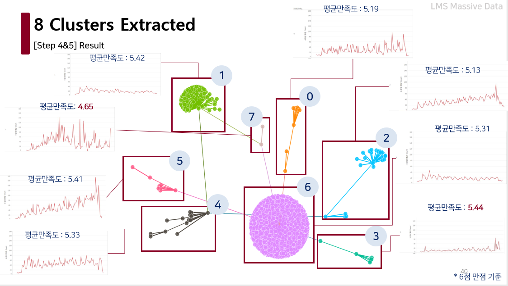
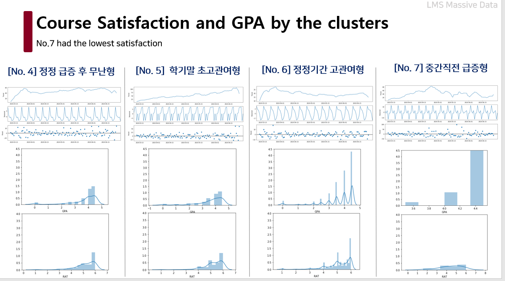

# Online Learning Patterns and Course Satisfaction Based on Lecture Clusters in COVID-19 era
* Clustered courses based on the Blackboard log data using machine learning and time-series data analysis and compared the average course satisfaction scores
* Suggested 8 types of courses for the Spring 2020 semester; Delivered at a forum

